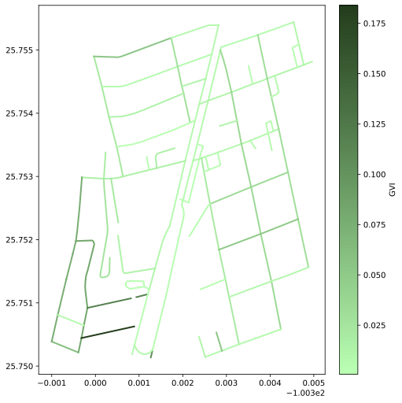

# GSV Walk Audit Stations

  

For a use case demonstration you can clone the repository and run <code>Notebook/station_example.ipynb</code>. Execution of the code requires some supplementary files, which we describe next:

## Model checkpoints

Model checkpoints for the segmentation and/or detection of (1) buildings, (2) Informal retail stalls, (3) Sky, and (4) Persons can be found in the following OneDrive folder: 

https://tecmx-my.sharepoint.com/:f:/g/personal/uriel_legaria_tec_mx/EiVp9UcLdMNLjLRK-K3EzdMBdDs098SPYbyWBmxCwNAjlg?e=XMdOtm

Such models should be placed in the Models folder of the repository before executing the example notebook. 

## Docker cointainer for Auto-MAPS

As part of the analysis we include the detection of Auto-MAPS features at non-intersection points. The Auto-MAPS tool developed by Bon Woo Koo and collaborators can be consulted in the following repository:

https://github.com/BonwooKoo/Auto_MAPS

We also refeer you to the paper where such technology is introduced: 

<blockquote>
Koo, B. W., Guhathakurta, S., & Botchwey, N. (2022). Development and validation of automated microscale walkability audit method. Health & place, 73, 102733. https://doi.org/10.1016/j.healthplace.2021.102733
</blockquote>

The Docker image where we installed such tool for execution of our analysis can be retrieved from Docker Hub:

https://hub.docker.com/r/urilp845/automaps_container

Once a container is ran with the image you can copy its instance id to the appropriate place in the example notebook.

## Conda environment

Packages required for the conda environment are included in <code>environment.yml</code>. 
